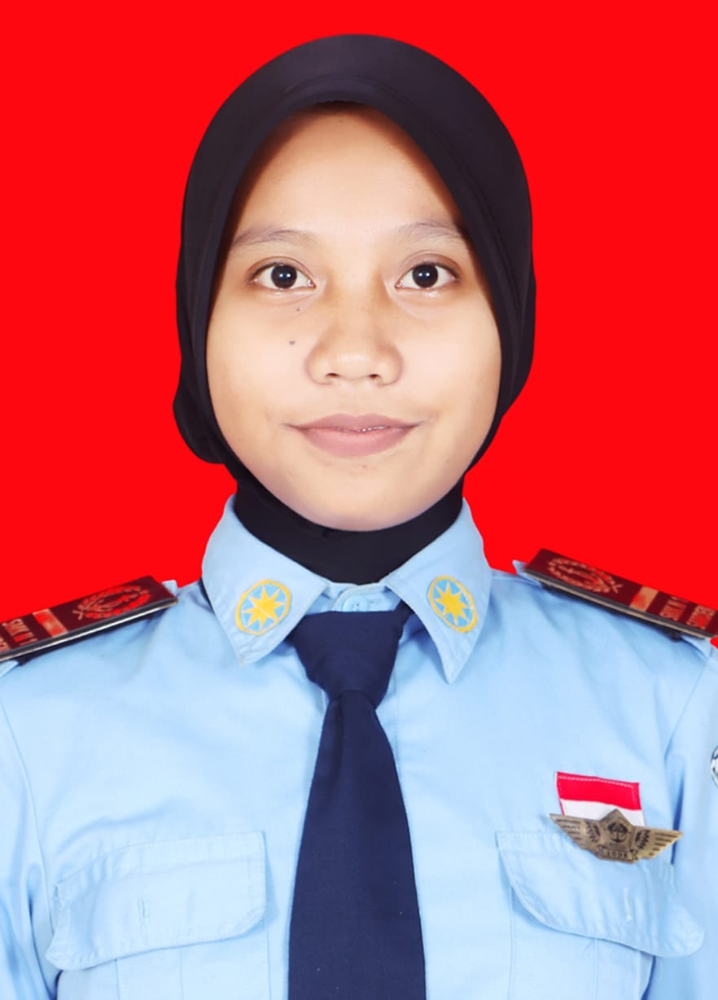

<!DOCTYPE html>
<html lang="id">
<head>
    <meta charset="UTF-8">
    <meta name="viewport" content="width=device-width, initial-scale=1.0">
    <title>CV - Maulida</title>
    
</head>
<body>
    

        <!-- SIDEBAR KIRI -->
        

            <!-- Ganti src dengan link foto kamu -->
            
            <h1>Maulida Rifa'ah</h1>
            
PELAJAR

            <h3>KONTAK</h3>
            

                
<strong>HP</strong>: 085840310722

                
<strong>Email</strong>: milolovers123457@gmail.com

                
<strong>Alamat</strong>: Kurahan 2 Murtigading Sanden Bantul Yogyakarta

            

            <h3>KEAHLIAN</h3>
            <ul>
                <li>Microsoft Office</li>
                <li>HTML, CSS, PHP</li>
                <li>Database MySQL</li>
                <li>Desain Canva</li>
            </ul>

            <h3>DATA PRIBADI</h3>
            
Lahir: Bantul, 08 Maret 2009

            
Agama: Islam

            
Status: pelajar

        

        <!-- KONTEN KANAN -->
        

            

                <h2>PROFIL SINGKAT</h2>
                
masih pelajar

            

            

                <h2>PENDIDIKAN</h2>
                

                    
SD N PIRING 2015-2021

                    
SMP N 1 SANDEN 2021-2024

                    
SMK N 1 SANDEN 2024-2027

                

                
            

        

    

</body>
</html>
